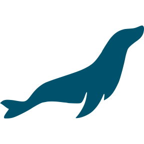

# Hey! 🤩 I'm a full-stack developer and love tinkering with PCs, servers, and all things tech 
 

- 💻 I am actively looking for an IT position

- ⌚ I invest most of my free time into Front-end & Back-end development, as well as System Operation

- 🆕 I strive to learn new languages & technologies

- 🥅 Current Goals: Optimization of prepared DB queries. Focus on front-end JS and clear UX. Contribute mroe to the Open Source community.

- 🥅 2023 Goal: New React project to further improve in ReactJS.

 

 

## 👋 Connect with me
 &nbsp;&nbsp;

&nbsp;&nbsp;&nbsp;&nbsp;

&nbsp;&nbsp;&nbsp;&nbsp;

&nbsp;&nbsp;&nbsp;&nbsp;

&nbsp;&nbsp;&nbsp;&nbsp;

  

## 🧑‍💻 Languages I use
 

   

## 🔧 Tools I use
 

   

## 🧑‍🏭 Projects I currently maintain

### &nbsp;&nbsp;&nbsp;&nbsp; VPS-hosted & maintainted using Git

 - [delidservices.com](https://delidservices.com) An e-commerce site built from the ground up, offering delid & relid services for PC enthusiasts
 - [rfdevs.com](https://rdevs.com) Personal site and other miscellanious things!

 

### &nbsp;&nbsp;&nbsp;&nbsp; Third-party hosted & maintainted using its admin panel
 - [lubemyswitches.co.uk](https://lubemyswitches.co.uk) An e-commerce site for mechanical keyboard needs & accessories
